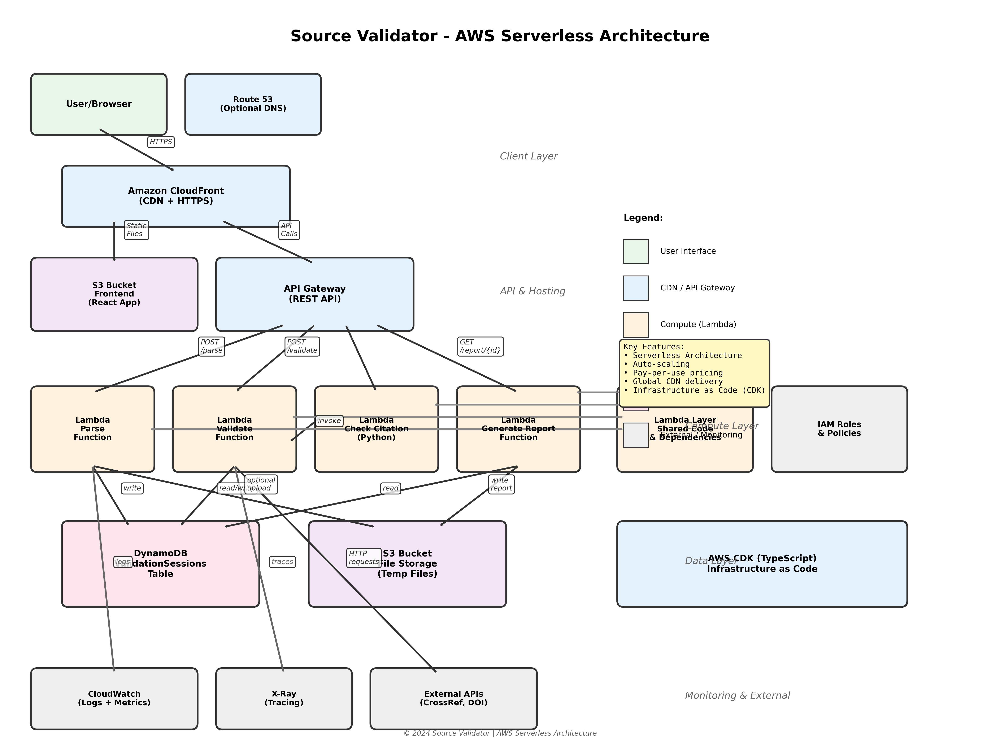
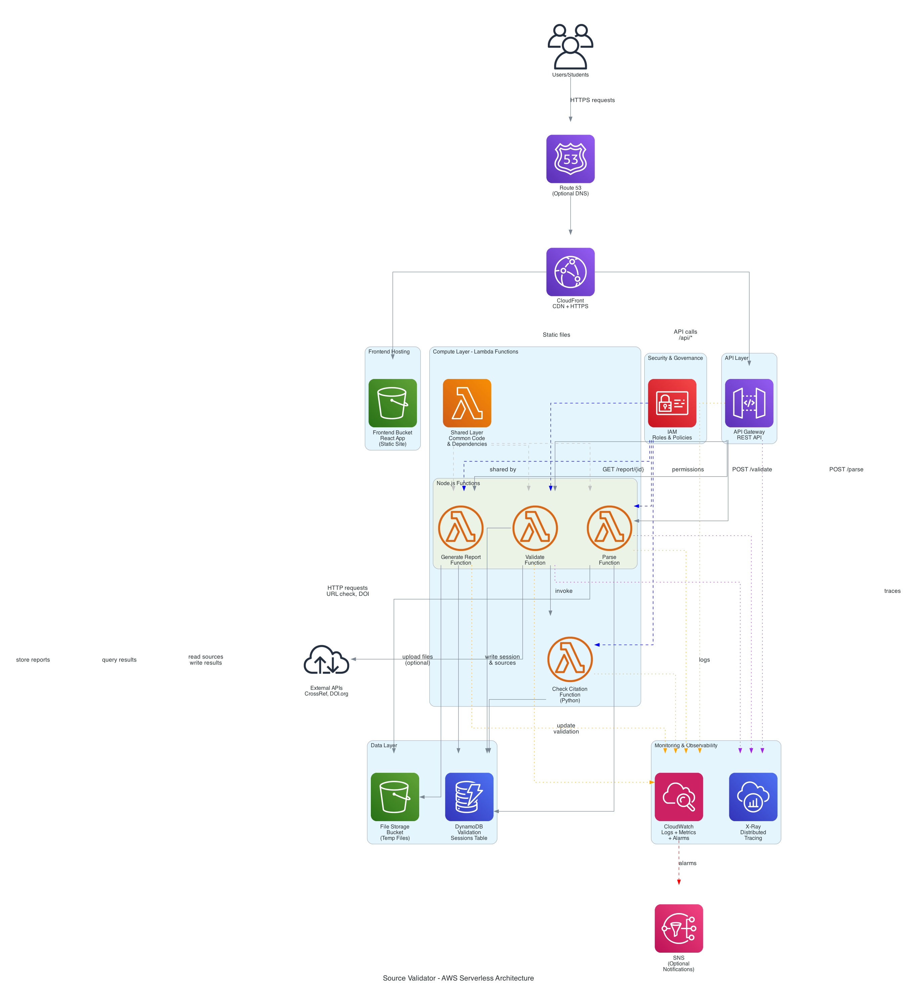

# Source Validator - Project Specifications

This directory contains all technical specifications for the Source Validator serverless application.

## 📋 Specification Documents

### 1. [PROJECT_SPEC.md](./PROJECT_SPEC.md)
**Main Project Specification**
- Project overview and problem statement
- Complete AWS serverless architecture (CDK-based)
- Technology stack details
- Development timeline (5 weeks)
- CI/CD pipeline with GitHub Actions
- Cost estimation and budgeting
- Testing strategy
- Monitoring and observability
- Security considerations
- Getting started guide

**Use this for**: Overall project understanding, setup instructions, and deployment strategy.

---

### 2. [INFRASTRUCTURE_SPEC.md](./INFRASTRUCTURE_SPEC.md)
**AWS Infrastructure & CDK Specification**
- Detailed AWS services configuration
  - Lambda (4 functions)
  - API Gateway (REST API)
  - DynamoDB (sessions table)
  - S3 (2 buckets: frontend + files)
  - CloudFront (CDN)
  - CloudWatch (monitoring)
  - X-Ray (tracing)
- Complete CDK stack implementation in TypeScript
- Custom CDK constructs
- IAM roles and permissions
- Multi-environment setup (dev/prod)
- Deployment commands and procedures
- Cost breakdown
- Troubleshooting guide

**Use this for**: Setting up AWS infrastructure, writing CDK code, deployment, and DevOps tasks.

---

### 3. [FRONTEND_SPEC.md](./FRONTEND_SPEC.md)
**React Frontend Application Specification**
- React 18 + TypeScript architecture
- Component structure and specifications
  - UploadForm
  - ResultsDashboard
  - SourceList
  - ValidationChart
  - ReportExport
- Data models and TypeScript interfaces
- API integration with Axios
- Custom React hooks
- Material-UI theming and styling
- Responsive design (mobile/tablet/desktop)
- State management (React Context + React Query)
- Testing strategy (Jest, React Testing Library, Cypress)
- Performance optimization
- Build and deployment to S3

**Use this for**: Building the React frontend, component development, UI/UX implementation.

---

### 4. [BACKEND_SPEC.md](./BACKEND_SPEC.md)
**Lambda Functions & Backend Logic Specification**
- Four Lambda functions detailed:
  1. **Parse Function** (Node.js) - Extract citations from text/files
  2. **Validate Function** (Node.js) - Validate URLs, format, credibility
  3. **Check Citation Function** (Python) - Deep format validation
  4. **Generate Report Function** (Node.js) - Create downloadable reports
- DynamoDB schema and access patterns
- Data models and interfaces
- External API integrations (CrossRef, DOI)
- Citation parsing algorithms (APA, MLA, Chicago)
- Validation scoring system
- Error handling and logging
- Testing strategy (unit + integration)
- Performance optimization
- Security best practices

**Use this for**: Implementing Lambda functions, business logic, validation algorithms, and API integrations.

---

## 🏗️ Architecture Diagrams

### Diagram 1: Detailed Flow Diagram


A comprehensive architecture diagram showing:
- User interaction flow
- CloudFront CDN layer
- API Gateway and S3 hosting
- Lambda function compute layer
- DynamoDB and S3 data layer
- Monitoring and external integrations
- Color-coded components by layer type
- Detailed connection labels

### Diagram 2: AWS Official Icons Diagram


Professional architecture diagram using official AWS service icons:
- **Users/Students** → Entry point
- **Route 53** (Optional DNS)
- **CloudFront** → CDN with HTTPS
- **S3 + CloudFront** → Frontend hosting (React)
- **API Gateway** → REST API endpoints
- **Lambda Functions** (4 functions in orange)
  - Parse Function (Node.js)
  - Validate Function (Node.js)
  - Check Citation Function (Python)
  - Generate Report Function (Node.js)
- **Lambda Layer** → Shared code and dependencies
- **DynamoDB** → Validation sessions database
- **S3** → File storage (temp files and reports)
- **CloudWatch** → Logs, metrics, and alarms
- **X-Ray** → Distributed tracing
- **IAM** → Roles and permissions
- **External APIs** → CrossRef, DOI.org
- **SNS** → Optional notifications

Both diagrams complement each other - the first provides detailed flow and labels, while the second uses official AWS icons for professional presentation.

---

## 🚀 Quick Start

### 1. Read the Specifications in Order:
```bash
1. PROJECT_SPEC.md      # Understand the overall project
2. INFRASTRUCTURE_SPEC.md   # Set up AWS and CDK
3. BACKEND_SPEC.md      # Implement Lambda functions
4. FRONTEND_SPEC.md     # Build React application
```

### 2. Set Up Development Environment:
```bash
# Install prerequisites
npm install -g aws-cdk
aws configure

# Clone or initialize project
mkdir source-validator && cd source-validator
cdk init app --language typescript

# Install dependencies
npm install
```

### 3. Follow the Timeline:
- **Week 1**: Infrastructure setup (CDK)
- **Week 2**: Backend - Parse function
- **Week 3**: Backend - Validation logic
- **Week 4**: Frontend - React app
- **Week 5**: Testing, documentation, deployment

---

## 📊 Technology Stack Summary

| Layer | Technology |
|-------|-----------|
| **Infrastructure** | AWS CDK (TypeScript) |
| **Frontend** | React 18, TypeScript, Material-UI |
| **Backend** | AWS Lambda (Node.js 20 + Python 3.12) |
| **API** | API Gateway (REST) |
| **Database** | DynamoDB |
| **Storage** | S3 |
| **CDN** | CloudFront |
| **Monitoring** | CloudWatch, X-Ray |
| **CI/CD** | GitHub Actions |

---

## 💰 Cost Estimate

### Free Tier (First 12 Months):
- **Monthly**: $0-2
- **Perfect for**: Student projects and prototypes

### After Free Tier:
- **Light usage** (1K validations/month): ~$5/month
- **Moderate usage** (10K validations/month): ~$15-25/month

---

## 🎯 Success Metrics

- **Parse accuracy**: 95%+ of common citation formats
- **Validation latency**: <2 seconds average
- **Capacity**: Handle 100+ sources per submission
- **Format detection**: 90%+ accuracy
- **Uptime**: 99.9% (AWS SLA)

---

## 📚 Additional Resources

- [AWS CDK Documentation](https://docs.aws.amazon.com/cdk/)
- [React Documentation](https://react.dev/)
- [AWS Lambda Developer Guide](https://docs.aws.amazon.com/lambda/)
- [Citation Style Guides - Purdue OWL](https://owl.purdue.edu/owl/research_and_citation/resources.html)
- [CrossRef API Documentation](https://www.crossref.org/documentation/retrieve-metadata/rest-api/)

---

## 🤝 Contributing

When working on this project:
1. Read the relevant spec document first
2. Follow the coding standards in each spec
3. Write tests for new features
4. Update documentation as needed
5. Use the provided architecture patterns

---

## 📝 Notes

- All specifications are based on AWS CDK (not SAM or Serverless Framework)
- TypeScript is used throughout for type safety
- Follow the serverless best practices outlined in each spec
- Cost estimates are approximate and may vary

---

**Last Updated**: February 2026
**Project Type**: Student project, serverless, source validation
**License**: MIT (or as specified by your institution)
